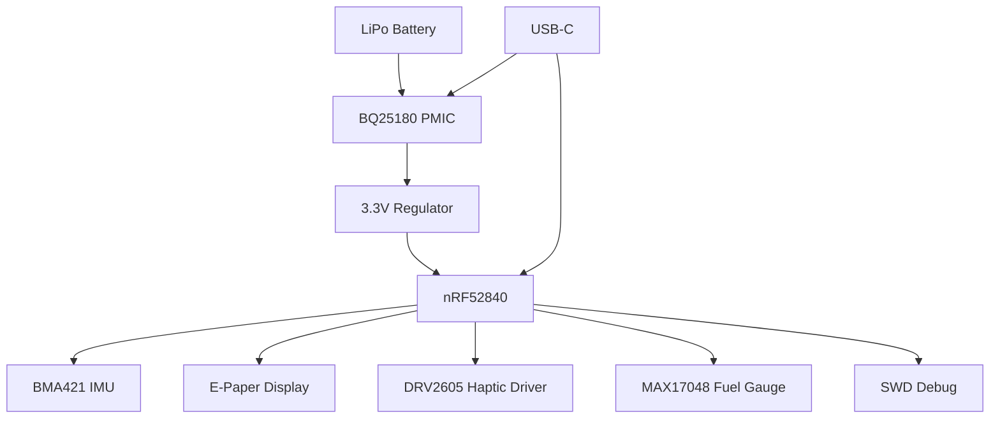

# InkTime

## Overview

InkTime is a low-power smartwatch built around the Nordic nRF52840 SoC, designed for efficient operation, wireless connectivity, and a clean e-paper display interface. The project focuses on power optimization, modular hardware design, and practical embedded system integration.

---

## Block Diagram

---

## Bill of Materials (BOM)

| Component      | Part Number   | Description          | Link (JLC) | Datasheet         |
| -------------- | ------------- | -------------------- | ---------- | ----------------- |
| MCU            | nRF52840-QFN  | BLE SoC              | JLC        | Nordic Datasheet  |
| PMIC           | BQ25180YBGR   | Charger + Power Path | JLC        | TI Datasheet      |
| IMU            | BMA421        | Accelerometer        | JLC        | Bosch Datasheet   |
| Fuel Gauge     | MAX17048G+T10 | Battery Monitor      | JLC        | Maxim Datasheet   |
| Haptic Driver  | DRV2605       | Vibration Driver     | JLC        | TI Datasheet      |
| Buck Converter | RT6160A       | Step-down regulator  | JLC        | Richtek Datasheet |
| USB Protection | USBLC6-2SC6   | ESD Protection       | JLC        | ST Datasheet      |
| Inductors      | Various       | Power filtering      | JLC        | Datasheets        |
| Capacitors     | Various       | Decoupling           | JLC        | Datasheets        |
| Resistors      | Various       | Pull-ups / config    | JLC        | Datasheets        |

---

## Hardware Functionality (Detailed)

### MCU (nRF52840)

Main processing unit. Handles:

* BLE communication
* Sensor data processing
* Display control
* Power management coordination

Runs at low power modes most of the time, wakes up on interrupts (IMU, buttons, timers).

---

### Power Management

#### BQ25180 PMIC

* Handles LiPo charging
* Power path management (system + battery)
* Integrated buck converter

#### RT6160 Buck Converter

* Steps voltage down efficiently to 3.3V
* Supplies MCU and peripherals

#### Power Design Notes

* Multiple decoupling capacitors placed close to ICs
* Separate analog and digital grounds where needed
* High-efficiency switching to maximize battery life

---

### IMU (BMA421)

* Connected via I2C
* Provides motion detection
* Generates interrupts for wake-up

Used for:

* Step detection
* Gesture-based wake

---

### E-Paper Display

* SPI communication
* Requires additional driving circuitry (boost + level shifting)
* Very low power (only consumes when refreshing)

Signals:

* MOSI, SCK (SPI)
* CS, DC, RST, BUSY (control)

---

### Fuel Gauge (MAX17048)

* Connected via I2C
* Monitors battery percentage
* Provides alerts when battery is low

---

### Haptic Driver (DRV2605)

* Controlled via I2C
* Drives vibration motor
* Used for notifications

---

### USB-C Interface

* Used for charging + debugging
* Includes ESD protection
* Connected to MCU USB pins

---

## nRF52840 Pin Usage

| Pin            | Function        | Reason                                   |
| -------------- | --------------- | ---------------------------------------- |
| P0.26 / P0.27  | I2C (SDA/SCL)   | Shared bus for IMU + Fuel Gauge + Haptic |
| P0.13 / P0.14  | USB D- / D+     | USB communication                        |
| P0.15 - P0.20  | SPI (Display)   | High-speed display communication         |
| P0.22 - P0.24  | Display Control | CS, DC, RST                              |
| P0.25          | Display BUSY    | Sync with display                        |
| P1.x           | GPIO            | Buttons / interrupts                     |
| P0.18          | RESET           | System reset                             |
| SWDIO / SWDCLK | Debug           | Programming                              |

Design decisions:

* I2C shared to reduce pin usage
* SPI dedicated for display performance
* Interrupt pins separated for responsiveness

---

## Power Consumption Considerations

* E-paper reduces display power drastically
* MCU spends most time in sleep (~uA consumption)
* IMU used as wake-up trigger
* Buck converter efficiency ~90%

Estimated:

* Sleep: ~20-50 µA
* Active: ~5-15 mA

---

## Gallery

